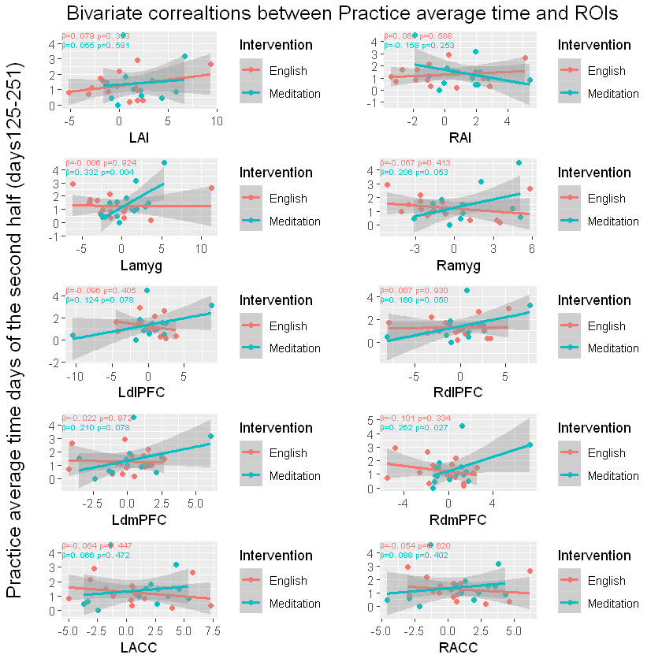
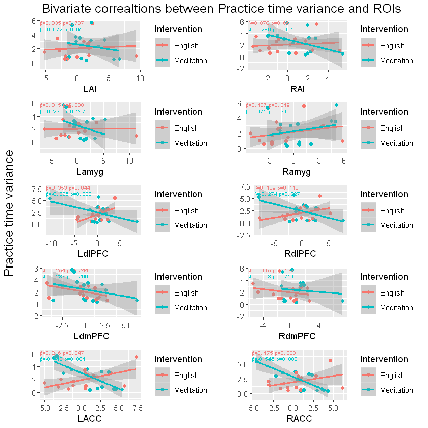
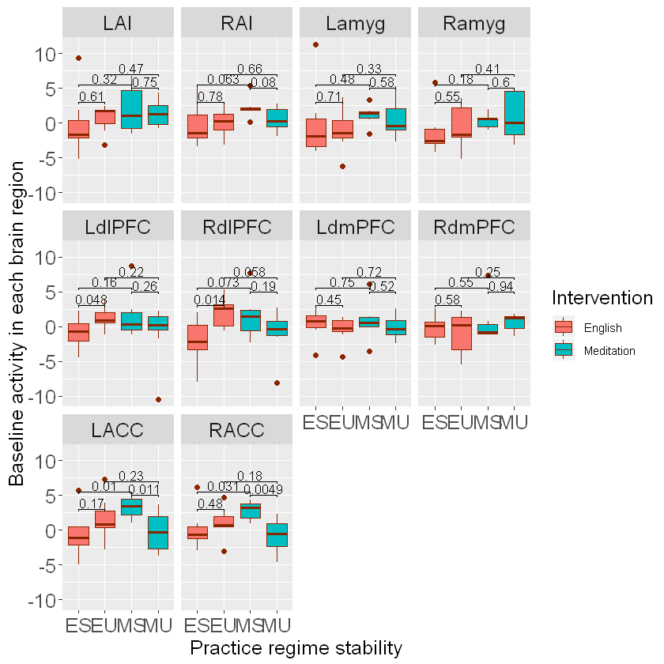
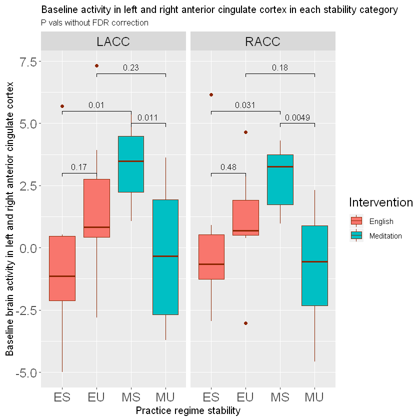

# Pre-existing brain activities associate with adherence to mindfulness practice in long-term: an fMRI study
## Summary 
### Introduction
There has been a surge of empirical research on the health benefits of mindfulness-based programs. However, studies have shown that optimally profiting from positive health effects of mindfulness requires certain amount of adherence to mindfulness practice. Mascaro and colleagues showed that activity in right amygdala in response to a self-pain task has a negative association with subsequent mindfulness practice time. With a similar approach, we have investigated whether it is possible to associate mindfulness practice adherence with baseline brain reactivity to negative emotional stimuli in a social context (socio-affective video task (SoVT)).
### Method
30 Healthy participants (mean70±5yo, 17 women) were randomized to complete a nine-month mindfulness (n = 15) or English program (n=15, active control). At baseline, functional neural responses to negative emotional stimuli (distress of others in SoVT paradigm) was measured for pre-selected regions of interest (ROI). The ROIs consisted of dorsolateral and dorsomedial prefrontal cortex (dlPFC and dmPFC respectively), amygdala, anterior cingulate cortex (ACC) and anterior insula (AI). Daily practice time was measured on a daily basis for both groups. Practice time average and practice time variance represented individuals’ practice adherence. They were regressed to the activities of each of the mentioned brain areas. In addition, suggested by data, a new variable to classify individuals’ was defined and labeled as “practice regime stability”. This variable was also regressed to baseline brain activities. 
### Results
Regression results show that practice time had significant positive associations with right dlPFC, right dmPFC and bilateral amygdala in mindfulness group and not in the active control (English group). In addition, practice time variance was negatively associated with the activity in bilateral dlPFC and ACC in mindfulness group. In English group however, left dlPFC and ACC were positively associated with practice time variance. Interestingly, “practice regime stability” had also significant positive associations with right ACC (RACC) and trending associations with left ACC (LACC) in the mindfulness group. 
### Overview of associations between baseline brain activities and practice time average 
 

### Overview of associations between baseline brain activities and practice time variance

### Overview of the brain activties in each of the newly-formed categories 

### Baseline activities in the anterior cingulate cortex (ACC) in each of the newly-formed categories 

### Discussion
Positive contribution of amygdala’s activity to subsequent practice time might reflect its important role in vigilance to emotional salience. Such vigilance might contribute to being in touch with emotional experiences. Accordingly higher amygdala activity can facilitate mindfulness state that esults in higher subsequent practice time. The positive contribution of prefrontal areas to mindfulness practice time might reflect their important role in cognitive control of emotions. Such control is needed by novice meditators for controlling over habitual reactions to emotional encounters. Therefore, prefrontal areas can facilitate immersing in the non-judgmental stance of mindfulness by controlling those habits.  Moreover, bilateral dlPFC and ACC had negative associations with mindfulness practice time variance. Such contribution might reflect their function in goal-directed behavior and planning. Conversely, the activity of LACC and left dlPFC was surprisingly higher in individuals with higher practice time variance in English group. This result might indicate that individuals English group who had higher recruitments of these areas, did not consider English practice as an important goal thus were not consistent with English practice. The positive association of “practice regime stability” and ACCs accentuate the role of this region in practice adherence. Moreover, this association point at the possibility that individuals’ different classes of practice adherence (stable and unstable regimes) can be linked to their ACC activities at baseline.
### Conclusion
Our findings are in line with previous literature for neural mechanisms of mindfulness practice and mindfulness-related health benefits. These results indicate that pre-existing neurobiological profiles might differentially predispose individuals to different mindfulness adherences. Since mindfulness adherence is associated with profiting from mindfulness-related health effects, such findings can have clinical relevance if supported by further studies. 
